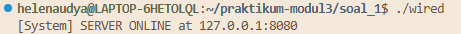
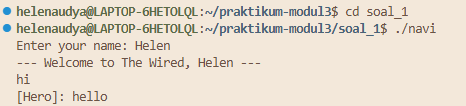
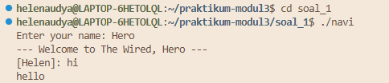
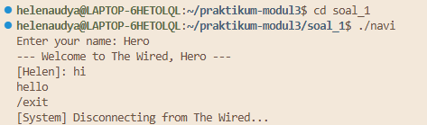
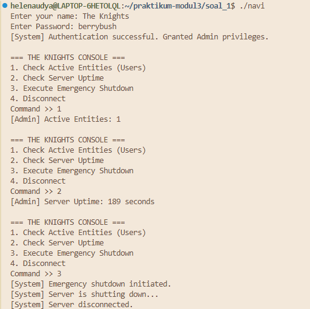
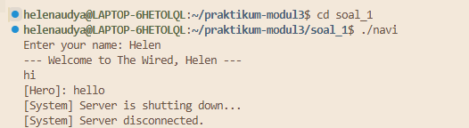
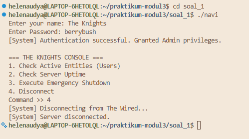
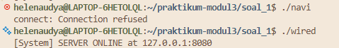
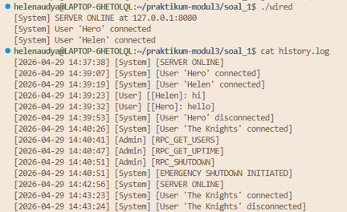

# SISOP-3-2026-IT-069

### Helen Audya Yuniarini (5027251069)
---
### Soal 1: Present Day, Present Time
---
#### Deskripsi Soal
Pada praktikum Sistem Operasi Modul 3 ini, kita diminta untuk mengimlementasikan suatu sistem komunikasi berbasis jaringan yang disebut **The Wired** di mana sistem ini terdiri dari dua komponen utama yaitu:
- Server (wired) sebagai pusat komunikasi
- Client (navi) sebagai entitas pengguna
Sistem **The Wired** ini dirancang untuk menghubungkan berbagai entitas dalam satu jaringan komunikasi. Setiap client yang terhubung wajib memiliki identitas unik berupa nama, dan komunikasi antar client dapat dilakukan secara realtime melalui mekanisme jaringan ini. Adapun beberapa fitur pada sistem yang harus dipenuhi:
1. Koneksi jaringan yang stabil
   
   Client harus terhubung ke server menggunakan IP dan port yang ditentukan di file protocol.
2. Identitas client
   
   Setiap client harus memiliki identitas unik dan tidak boleh ada dua client dengan nama yang sama.
3. Broadcast komunikasi
   
   Pesan dari client akan diteruskan ke seluruh client aktif lainnya secara real time.
4. Logging aktivitas

   Semua aktivitas tercatat dalam file `history.log` dengan format log `[YYYY-MM-DD HH:MM:SS] [Actor] [Message]`.
5. Admin `The Knights`
   
   Memiliki seluruh akses khusus dengan autentikasi password. Admin dapat menjalankan:
   - Jumlah user aktif
   - Melihat uptime server
   - Melakukan emergency shutdown
6. Manajemen client
   
   Sistem harus mampu menangani banyak koneksi dan mendeteksi client yang disconnect.
7. Client `NAVI`
   
   Bertindak sebagai terminal komunikasi yang mendukung fitur input pesan, menerima broadcast, dan disconnect degan `/exit`.

#### Langkah Penyelesaian
1. Pembagian Aritektur Sistem
   Membuat 4 file utama berupa:
   - `protocol.h` : konstanta dan deklarasi fungsi
   - `protocol.c` : implementasi utilitas umum
   - `wired.c`    : server utama
   - `navi.c`     : client
2. Penjelasan Kode
   a. `protocol.h`
      ```
      #ifndef PROTOCOL_H
      #define PROTOCOL_H

      #define SERVER_IP "127.0.0.1"
      #define SERVER_PORT 8080
      #define BUFFER_SIZE 1024
      #define MAX_CLIENTS 100
      #define NAME_SIZE 50

      #define ADMIN_NAME "The Knights"
      #define ADMIN_PASSWORD "berrybush"

      #define TYPE_NORMAL 0
      #define TYPE_ADMIN 1

      void trim_newline(char *str);
      void write_history(const char *actor, const char *message);
      void send_text(int socket_fd, const char *message);

      #endif
      ```

      File ini berfungsi sebagai **header utama** yang menyimpan konfigurasi (pengaturan dasar) sistem, konstanta global (nilai tetap, admin), dan deklarasi fungsi bersama oleh server (`wired.c`) dan client (`navi.c`).
      **Konstanta Server:**
      ```
      #define SERVER_IP "127.0.0.1"
      #define SERVER_PORT 8080
      ```
      berfungsi untuk menentukan alamat server (localhost) dan meentukan port komunikasi. Disini semua client (NAVI) akan terhubung ke alamat ini untuk masuk ke "The Wired"
      ```
      #define BUFFER_SIZE 1024
      ```
      berfungsi untuk menentukan ukuran maksimal buffer dalam menerima dan mengirim pesan untuk mencegah overflow dan menjamin konsistensi data.
      ```
      #define MAX_CLIENTS 100
      ```
      berfungsi untuk menentukan jumlah maksimal client yang bisa terhubung secara bersamaan.
      ```
      #define NAME_SIZE 50
      ```
      berfungsi menentukan batas panjang nama client untuk menghindari input berlebihn dan menjaga efisiensi memori.

      **Konstanta Admin**
      ```
      #define ADMIN_NAME "The Knights"
      #define ADMIN_PASSWORD "berrybush"
      ```
      berfungsi untuk menentukan identitas khusus admin dan autentikasi akses admin.

      **Tipe Client**
      ```
      #define TYPE_NORMAL 0
      #define TYPE_ADMIN 1
      ```
      berfungsi untuk membedakan jenis client dalam sistem. Untuk tipe normal bisa chat (broadcast), sedangkan tipe admin tidak bisa ikut broadcast tetapi bisa menjalankan command khusus.

   b. `protocol.c`
      File `protocol.c` berfungsi sebagai implementasi dari fungsi-fungsi utilitas yang digunakan oleh seluruh sistem.
      ```
      void trim_newline(char *str) {
         str[strcspn(str, "\n")] = '\0';
      }
      ```
      berfungsi untuk membersihkan input agar tidak error saat diproses.
      ```
      void send_text(int socket_fd, const char *message) {
         send(socket_fd, message, strlen(message), 0);
      }
      ```
      berfungsi untuk mengirim pesan ke client/server melalui socket.
      ```
      void write_history(const char *actor, const char *message){
         FILE *fp = fopen("history.log", "a");
         if (fp == NULL) {
            return;
         }

         time_t now = time(NULL);
         struct tm *t = localtime(&now);

         fprintf(fp,
                  "[%04d-%02d-%02d %02d:%02d:%02d] [%s] [%s]\n",
                  t->tm_year + 1900,
                  t->tm_mon + 1,
                  t->tm_mday,
                  t->tm_hour,
                  t->tm_min,
                  t->tm_sec,
                  actor,
                  message);

         fclose(fp);
      }
      ```
      berfungsi untuk menyimpan semua aktivitas sistem ke file `history.log`

   c. `wired.c`
      File `wired.c` berfungsi sebagai server pusat yang mengeloa keseluruhan komunikasi dalam "The Wired", termasuk koneksi cient, broadcast pesan, autentikasi admin, logging, dan kontrol sistem.
      ```
      typedef struct {
      int socket_fd;
      char name[NAME_SIZE];
      int type;
      } Client;
      ```
      berfungsi untuk menyimpan informasi lengkap setiap client berupa koneksi client (`socket_fd`), identitas (`name`), dan tipe client normal/admin (`type`).
      ```
      Client clients[MAX_CLIENTS];
      int server_socket;
      time_t server_start;
      ```
      berfungsi untuk menyimpan semua client aktif, socket utama server, dan mencatat waktu server untuk mulai.
      ```
      void init_clients() {
         for (int i = 0; i < MAX_CLIENTS; i++) {
            clients[i].socket_fd = 0;
            clients[i].name[0] = '\0';
            clients[i].type = TYPE_NORMAL;
         }
      }
      ```
      berfungsi untuk menginisialisasi semua slot client menjadi kosong untuk menghindari data sampah.
      ```
      int is_name_used(const char *name) {
         for (int i = 0; i < MAX_CLIENTS; i++) {
            if (clients[i].socket_fd != 0 &&
                  strcmp(clients[i].name, name) == 0) {
                  return 1;
            }
         }
         return 0;
      }
      ```
      berfungsi untuk mengecek apakah nama sudah dipakai oleh client lain, bertujuan untuk menjamin identitas unik dan mencegah konflik komunikasi.
      ```
      int add_client(int socket_fd, const char *name, int type) {
      for (int i = 0; i < MAX_CLIENTS; i++) {
         if (clients[i].socket_fd == 0) {
               clients[i].socket_fd = socket_fd;
               strncpy(clients[i].name, name, NAME_SIZE - 1);
               clients[i].name[NAME_SIZE - 1] = '\0';
               clients[i].type = type;
               return i;
               }
         }
      return -1;
      }
      ```
      berfungsi untuk menambahkan client baru dalam sistem.
      ```
      void remove_client(int index) {
         char log_msg[BUFFER_SIZE];

         if (clients[index].socket_fd != 0) {
            snprintf(log_msg, sizeof(log_msg),
                     "User '%s' disconnected",
                     clients[index].name);

            write_history("System", log_msg);

            close(clients[index].socket_fd);
            clients[index].socket_fd = 0;
            clients[index].name[0] = '\0';
            clients[index].type = TYPE_NORMAL;
         }
      }
      ```
      berfungsi untuk menghapus client dari sistem.
      ```
      void broadcast_chat(int sender_index, const char *chat) {
         char message[BUFFER_SIZE];
         char log_msg[BUFFER_SIZE];

         snprintf(message, sizeof(message),
                  "[%s]: %s\n",
                  clients[sender_index].name,
                  chat);

         snprintf(log_msg, sizeof(log_msg),
                  "[%s]: %s",
                  clients[sender_index].name,
                  chat);

         write_history("User", log_msg);

         for (int i = 0; i < MAX_CLIENTS; i++) {
            if (clients[i].socket_fd != 0 &&
                  i != sender_index &&
                  clients[i].type == TYPE_NORMAL) {
                  send_text(clients[i].socket_fd, message);
            }
         }
      }
      ```
      berfungsi untuk mengirim pesan dari client satu ke semua client lain.
      ```
      void send_admin_menu(int socket_fd) {
         send_text(socket_fd,
            "\n=== THE KNIGHTS CONSOLE ===\n"
            "1. Check Active Entities (Users)\n"
            "2. Check Server Uptime\n"
            "3. Execute Emergency Shutdown\n"
            "4. Disconnect\n"
            "Command >> "
         );
      }
      ```
      berfungsi untuk menampilkan menu khusus admin berupa cek user aktif, cek server uptime, emergency shutdown, dan disconnect.
      ```
      void shutdown_server() {
         write_history("System", "EMERGENCY SHUTDOWN INITIATED");

         for (int i = 0; i < MAX_CLIENTS; i++) {
            if (clients[i].socket_fd != 0) {
                  send_text(clients[i].socket_fd,
                           "[System] Server is shutting down...\n");
                  close(clients[i].socket_fd);
                  clients[i].socket_fd = 0;
            }
         }

         close(server_socket);
         exit(0);
      }
      ```
      berfungsi untuk mematikan server secara paksa (emergency shutdown), kontrol penuh oleh admin.
      ```
      void handle_admin_command(int index, const char *command)
      ```
      berfungsi untuk memproses perintah dari admin sesuai dengan command yang diinput admin.
      ```
      void accept_new_client()
      ```
      berfungsi untuk menangani koneksi client baru. Alurnya berupa terima koneksi (accept) dan terima nama client. Apabila kosong maka reject, duplikat reject. Jika admin, minta password, jika sesuai beri akses admin. Jika user biasa, tambahkan ke sistem dan kirim pesan welcome.
      ```
      int main() {
      struct sockaddr_in server_addr;
      fd_set readfds;

      server_start = time(NULL);
      init_clients();

      server_socket = socket(AF_INET, SOCK_STREAM, 0);
      if (server_socket < 0) {
         perror("socket");
         exit(1);
      }

      int option = 1;
      setsockopt(server_socket,
                  SOL_SOCKET,
                  SO_REUSEADDR,
                  &option,
                  sizeof(option));

      server_addr.sin_family = AF_INET;
      server_addr.sin_addr.s_addr = inet_addr(SERVER_IP);
      server_addr.sin_port = htons(SERVER_PORT);

      if (bind(server_socket,
               (struct sockaddr *) &server_addr,
               sizeof(server_addr)) < 0) {
         perror("bind");
         close(server_socket);
         exit(1);
      }

      if (listen(server_socket, 10) < 0) {
         perror("listen");
         close(server_socket);
         exit(1);
      }

      printf("[System] SERVER ONLINE at %s:%d\n",
            SERVER_IP,
            SERVER_PORT);

      write_history("System", "SERVER ONLINE");

      while (1) {
         FD_ZERO(&readfds);
         FD_SET(server_socket, &readfds);

         int max_fd = server_socket;

         for (int i = 0; i < MAX_CLIENTS; i++) {
               int socket_fd = clients[i].socket_fd;

               if (socket_fd > 0) {
                  FD_SET(socket_fd, &readfds);
               }

               if (socket_fd > max_fd) {
                  max_fd = socket_fd;
               }
         }

         int activity = select(max_fd + 1,
                                 &readfds,
                                 NULL,
                                 NULL,
                                 NULL);

         if (activity < 0) {
               perror("select");
               continue;
         }

         if (FD_ISSET(server_socket, &readfds)) {
               accept_new_client();
         }

         for (int i = 0; i < MAX_CLIENTS; i++) {
               int socket_fd = clients[i].socket_fd;

               if (socket_fd > 0 && FD_ISSET(socket_fd, &readfds)) {
                  char buffer[BUFFER_SIZE];

                  memset(buffer, 0, sizeof(buffer));

                  int received = recv(socket_fd,
                                       buffer,
                                       sizeof(buffer) - 1,
                                       0);

                  if (received <= 0) {
                     remove_client(i);
                     continue;
                  }

                  trim_newline(buffer);

                  if (clients[i].type == TYPE_ADMIN) {
                     handle_admin_command(i, buffer);
                  } else {
                     if (strcmp(buffer, "/exit") == 0) {
                           send_text(socket_fd,
                                    "[System] Disconnecting from The Wired...\n");
                           remove_client(i);
                     } else {
                           broadcast_chat(i, buffer);
                     }
                  }
               }
         }
      }
      ```
   d. `navi.c`
      File `navi.c` berfungsi sebagai antarmuka client yang memungkinkan user untuk terhubung ke server, mengirim pesan, menerima broadcast, serta melakukan disconnect.
      ```
      int client_socket;
      ```
      berfungsi untuk menyimpan koneksi client ke server.
      ```
      void handle_sigint(int sig) {
         send_text(client_socket, "/exit");
         printf("\n[System] Disconnecting from The Wired...\n");
         close(client_socket);
         exit(0);
      }
      ```
      berfungsi untuk handle client agar disconect dengan aman.
      ```
      int main()
      ```
      Program dimulai dengan menghubungkan client ke server, kemudian user memasukkan identitas. Setelah itu, client masuk ke loop komunikasi yang terus memantau input user dan pesan dari server secara bersamaan menggunakan select(). Setiap pesan dari server akan ditampilkan, sedangkan input user akan dikirim ke server. Proses ini berjalan terus hingga user keluar atau koneksi terputus, lalu client menutup koneksi dengan aman.

#### Output











#### Error Handling
1. Nama kosong (Invalid Identitiy)
   ```
   if (strlen(name) == 0)
   ```
   User tidak punya identitas dan broadcast menjadi aneh seperti `[]: hello`, logging tidak jelas, dan memicu bug saat validasi user. Solusi berupa mengirim pesan error dan disconnect client.
   ```
   send_text(new_socket, "[System] Invalid identity.\n");
        close(new_socket);
        return;
   ```
2. Nama duplikat
   ```
   if (is_name_used(name))
   ```
   Terdapat dua user yang memakai nama yang sama. Solusi berupa menolak koneksi dan mengirim pesan (`"[System] The identity '%s' is already synchronized in The Wired.\n"`)
3. Server penuh
   ```
   if (index == -1)
   ```
   Slot client sudah habis, apabila dipaksa masuk bisa crash. Solusinya dengan menolak client baru dan mengirim pesan (`"[System] Server is full.\n"`).
4. Client disconnect mendadak
   ```
   if (received <= 0)
   ```
   Dapat memicu beberapa masalah seperti socket masih tersimpan dan slot client tidak dibersihkan. Solusi:
   ```
   remove_client(i);
   ```
   Menutup socket, hapus data client, dan logging disconnect.
5. Password Admin salah
   ```
   if (strcmp(password, ADMIN_PASSWORD) != 0)
   ```
   User mencoba akses admin tanpa hak yang berisiko shutdown dan bisa akses data sistem. Solusi berupa menolak akses dan menutup koneksi.
6. Command Admin tidak valid
   ```
      else {
      send_text(... "Invalid command");
   }
   ```
   Admin input perintah yang tidak dikenali oleh server dan berisiko program error. Solusi: mengirim pesan error dan tidak menjalankan apapun.
7. File log gagal dibuka
   ```
   if (fp == NULL){
        return;
    }
   ```
   File tidak bisa dibuat/dibuka sehingga logging berisiko gagal. Solusinya abaikan (`return`).
8. Error saat select()
   ```
   if (activity < 0)
   ```
   Kesalahan pada sistem I/O. Solusi berupa cetak error dan lanjut loop (`continue`).
9.  Input kosong dari user (Client Side)
      ```
      if (strlen(buffer) == 0) {
                  continue;
               }
      ```
      User tekan enter tanpa isi yang berdampak pada spam kosong ke server dan membebani sistem. Solusi: diabaikan (`continue`).

10. Graceful Exit
    
      Client keluar tanpa memberi tahu server sehingga server tidak tahu apabila client sudah keluar dan slot tetap terpakai. Solusi berupa mengirim `/exit`.

#### Kendala
1. Tidak bisa connect ke server
   
   Selama pengujian, client tidak dapat terhubung ke server sehingga komunikasi tidak dapat dilakukan. 
   Penyebab: Server dalam kondisi tidak aktif : server sebelumnya telah dihentikan akibatnya connect gagal.
   Solusi: Memastikan server aktif sebelum client dijalankan dengan menjalankan ulang server (`wired.c`).
   
2. Kesalahan format username admin
   
   Ketentuan soal hanyalah diperbolehkan untuk mengganti password dan nama admin tetap `The Knights`. Namun saat pengerjaan kurang teliti dalam membaca soal sehingga terjadi miss pada penulisan nama admin.
   Solusi: melakukan perubahan pada kode dalam file `protocol.h`
   ```
   #define ADMIN_NAME "The Knights"
   ```
   


